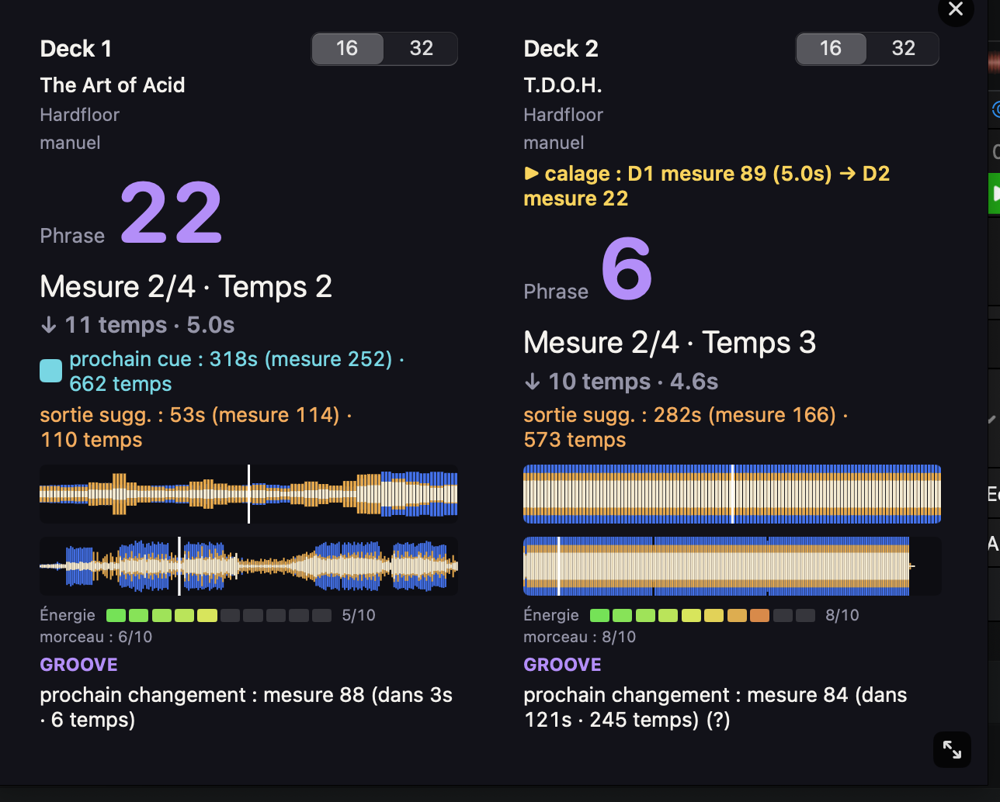

# djay-phrase-tool

A read-only companion tool for [Algoriddim djay Pro](https://www.algoriddim.com/djay-pro-mac) on macOS that adds **live phrase analysis** — a feature DJs have been [asking for since 2016](https://community.algoriddim.com/t/can-we-have-phrase-analysis/23688) and djay has never shipped.

**Just want to install and run it? → Jump to [Setup](#setup).**

It shows, per deck, in real time: which beat/bar/phrase you're in, a countdown to the next phrase boundary, a live scrolling waveform, detected track structure (intro/groove/break/drop/outro), a Mixed In Key-style energy scale, and countdowns to your own cue points and to detected mix-out points — all without ever writing to djay's database or touching your audio files.

It's built from three layers, each usable independently:

1. **Live phrase counter** — reads djay Pro's UI in real time via the macOS Accessibility API and computes phrase position from it.
2. **Library reader** — reads djay's own analysis cache (BPM, beatgrid, cue points, waveform) directly, so the phrase counter needs zero manual calibration for any track djay has already analyzed.
3. **Structure & energy detection** — turns djay's cached waveform data into intro/build/drop/break/outro labels and an energy curve, entirely from data djay already computed (no audio file access needed — this works on streamed Apple Music/Spotify/SoundCloud tracks too, not just local files).

## Why this exists

djay Pro doesn't expose a phrase/structure view anywhere in its UI, on any platform, despite rekordbox (Pioneer) having shipped one for years. This project reverse-engineers djay's own on-disk data — its live accessibility tree, its SQLite library database, and its per-track analysis cache — to build the feature externally, without modifying djay or its data in any way.

Read [`docs/TECHNICAL.md`](docs/TECHNICAL.md) for the full reverse-engineering writeup: the binary formats, the extraction techniques, what's confirmed vs. still a hypothesis, and what didn't work.

## Screenshot



Shown in French here — the panel's own text automatically follows your Mac's system language (French or English), nothing to configure. djay Pro itself is read correctly regardless of which language *it's* set to, independently of this.

## Safety

**Strictly read-only.** This tool never writes to djay's database, never modifies your audio files, and never sends djay any commands. It only *reads*:

- djay Pro's live accessibility tree (the same UI text macOS's Accessibility Inspector or VoiceOver can already read from any app)
- djay's own SQLite library database, in read-only mode, while djay is running (SQLite's WAL mode is designed for exactly this and was verified safe empirically)
- djay's per-track `.djayMetadata` analysis cache files

If you're uneasy about the SQLite access specifically, quit djay Pro first — reading the database only requires djay to have analyzed a track at some point in the past, not to be running right now (with the one exception that the *live* phrase counter needs djay open, since it reads the UI).

## Project layout

```
PhraseCounterApp/       Swift package — the live HUD app (built on a fork of
                         kyleawayan/djay-pro-bridge, see Credits)
analysis-scripts/       Python reference implementations for the structure/
                         energy detection, and the original binary-format
                         exploration scripts
docs/TECHNICAL.md        Full technical writeup — binary formats, extraction
                         methodology, validation, open questions
```

## Setup

Requires macOS. There are three ways to get it running — pick one:

| | What it is | Best for |
|---|---|---|
| **[① Compile from source](#option-1-compile-from-source-recommended)** | A few Terminal commands you paste in yourself, no account needed | Recommended default — see [Safety](#safety) for why |
| **[② Prebuilt app](#option-2-prebuilt-app-no-compiling)** | Download a ready-to-run `.app`, no Terminal needed | Fastest way to just try it |
| **[③ Claude Code](#option-3-claude-code-no-terminal-experience-needed)** | An AI assistant runs the setup for you and explains each step | Never used Terminal before, want it hand-held |

### Option 1: Compile from source (recommended)

Requires Xcode Command Line Tools — a full Xcode install is not needed to build and run the app, only to run its test suite. No paid account or subscription of any kind is needed for the steps below.

1. **Open Terminal**: press `Cmd + Space`, type `Terminal`, press `Enter`. A plain window with text will open — this is normal.
2. **Install the Xcode Command Line Tools** (skip if you've already installed them before): copy the line below (select it, `Cmd+C`), click inside the Terminal window, paste it (`Cmd+V`), then press `Enter`:
   ```bash
   xcode-select --install
   ```
   A macOS installer window will pop up — click through its prompts to install. This only downloads Apple's own command-line developer tools, nothing from this project.
3. Grant Accessibility permission to whatever terminal app you'll run this from (System Settings → Privacy & Security → Accessibility).
4. Open djay Pro and load a track on at least one deck.
5. Build and run — either:
   - copy, paste (`Cmd+V`), and run these two lines in Terminal, one at a time (press `Enter` after each):
     ```bash
     cd PhraseCounterApp
     ```
     ```bash
     swift run PhraseCounterApp
     ```
   - or, simpler: just double-click **`Launch PhraseCounterApp.command`** at the repo root — no copying or typing at all (first double-click may show a macOS security prompt — right-click it → Open → Open once instead, then double-click works normally after that).
6. A floating panel appears, staying above djay Pro. For a track djay has already analyzed, the phrase counter starts automatically — no calibration needed. For a track djay hasn't analyzed yet (or if its automatic beatgrid is wrong), press `⌃⌥1` (deck 1) or `⌃⌥2` (deck 2) on the first kick to calibrate manually; djay Pro's own "Edit Grid" corrections are also read and take priority automatically when present.

The panel is resizable (drag any edge/corner, everything in it scales together) and has a close button (×) in its top-right corner. Its text follows your Mac's system language — French if your system is set to French, English otherwise (this is about the panel's *own* text; djay Pro's UI itself can be in whatever language you already have it in, read separately — see [`docs/TECHNICAL.md`](docs/TECHNICAL.md#reading-djays-live-ui-accessibility-api)).

### Option 2: Prebuilt app (no compiling)

A prebuilt, unsigned `.app` — no Xcode Command Line Tools, no Terminal at all. This is a convenience option, not the primary path (see [Safety](#safety) for why source-compile is the documented default) — but if you'd rather just try it first, here's every click, nothing assumed:

> ⚠️ **djay Pro must already be open, with a track loaded on at least one deck, *before* you launch this app** (step 6 below) — the app only checks once, at launch, and doesn't wait or retry. Skip this and it'll show a clear "djay Pro doesn't appear to be running" error when you open it — not silent failure, but easy to avoid by doing djay Pro first.

1. **Go to the Releases page.** Click here: [Releases page](https://github.com/yanchau/djay-phrase-tool/releases/latest). This is GitHub's page for finished, downloadable versions of the project (as opposed to the source code you'd need to compile yourself in Option 1).

2. **Download the app.** Scroll down slightly to a section called **Assets**, and click on `PhraseCounterApp-macOS.zip` to download it. It'll land in your Downloads folder, like any other download.

3. **Unzip it.** Find `PhraseCounterApp-macOS.zip` in Finder (or click it in your browser's download bar) and double-click it. This creates a new file next to it named `PhraseCounterApp.app` — that's the actual app.

4. **Move it somewhere permanent** (optional but recommended): drag `PhraseCounterApp.app` into your **Applications** folder, the same place all your other apps live. You can skip this and run it straight from Downloads too, it'll still work.

5. **Open djay Pro and load a track** on at least one deck — do this now, before the next step (see the warning above).

6. **Open the app for the first time — this needs one extra click because the app is unsigned** (there's no Apple Developer ID behind this project, so macOS doesn't recognize it yet):
   - **Don't** just double-click it — macOS will refuse and show a warning that it's "from an unidentified developer." This is normal and expected, not an error on your end.
   - Instead, **right-click** (or hold `Ctrl` and click) on `PhraseCounterApp.app`
   - Choose **Open** from the menu that appears
   - A dialog pops up warning that the app is from an unidentified developer — click **Open** again on that dialog
   - It only asks this once. From now on, a normal double-click opens it directly.
   - If macOS instead says the app **"is damaged and can't be opened"** (a different, unsigned-app-specific Gatekeeper quirk — moving it to the Trash is *not* actually required, despite what the dialog suggests): open Terminal (`Cmd+Space`, type `Terminal`, `Enter`), type `xattr -cr ` (with a trailing space, don't press Enter yet), drag `PhraseCounterApp.app` into the Terminal window so its path fills in, then press `Enter`. Try opening it again with right-click → Open as above.

7. **Grant Accessibility permission.** The first time it actually runs, macOS will ask for permission to control your Mac's accessibility features — this is what lets the app read djay Pro's on-screen info. Either click **Open System Settings** in that prompt and turn on the toggle for **PhraseCounterApp**, or go there yourself: Apple menu (top-left corner) → System Settings → Privacy & Security → Accessibility. If you already went through this once for an earlier download of the app and it's still not working, open Accessibility settings and check whether **PhraseCounterApp** is listed twice (once per version you've downloaded) — remove the old entry with the **−** button and re-grant permission for the current one.

8. A floating panel appears above djay Pro, same as Option 1 — phrase counter, waveform, structure, energy, cue countdowns. Same calibration behavior too (`⌃⌥1`/`⌃⌥2` on the first kick for any track djay hasn't auto-analyzed yet).

### Option 3: Claude Code (no Terminal experience needed)

An AI assistant (Claude Code) reads this repo's README and runs the setup for you, explaining each step in plain language and asking permission before anything that changes your Mac. Requires a paid Claude plan or API credits (Claude Code isn't free), but zero coding knowledge.

Full walkthrough: [`docs/GETTING-STARTED-FOR-BEGINNERS.md`](docs/GETTING-STARTED-FOR-BEGINNERS.md) — click it, it opens straight in your browser, nicely formatted, nothing to download first.

## What's read-only vs. what's stored locally

The *only* thing this tool ever writes is your own manual calibrations (if you use `⌃⌥1`/`⌃⌥2`), saved to `~/djay-phrase-tool/data/downbeat-offsets.json` — never inside djay's own data. Nothing about your library ever leaves your machine.

## Known limitations

- djay's Accessibility tree is view-dependent — some fields (elapsed/remaining time in particular) briefly become unavailable when djay's own UI changes panels (e.g. expanding the library browser). The app caches the last known value to ride out most of these, but loading a *brand new* track while the library panel is already expanded has no prior value to fall back on; collapsing and re-expanding the library panel once resolves it.
- djay only exposes BPM to one decimal place in its UI, which limits the precision of anything derived from the *live* BPM reading over long time spans (this is why a "continuous phase offset between two synced decks" feature was tried and removed — it would have shown drift that doesn't actually exist in djay's own audio engine, which stays phase-locked internally at full precision).
- The automatic structure/transition detection (break/drop/intro/outro boundaries) is a heuristic over djay's own *cached, low-resolution* waveform (~2–11 samples/second, not the real audio) — validated to high precision on some tracks, with real false positives/negatives on others. Your own cue points (read directly, ground truth) are shown alongside it, not as a replacement.
- Two things were investigated and explicitly abandoned after real effort — documented in `docs/TECHNICAL.md` in case someone wants to pick them back up: decoding the musical key from djay's analysis blob (found a plausible field, couldn't find a consistent mapping across test tracks), and decoding per-cue-point custom colors (found the field that appears/disappears with custom colors, couldn't decode its value format).

## Credits

- Built on top of [kyleawayan/djay-pro-bridge](https://github.com/kyleawayan/djay-pro-bridge) (MIT), which did the original Accessibility API groundwork for reading djay Pro's live deck state.
- The competitive-research section of `docs/TECHNICAL.md` also references [parabolala/djtools](https://github.com/parabolala/djtools) and [xsaardo/Djay-Pro-2-Export-Tools](https://github.com/xsaardo/Djay-Pro-2-Export-Tools), earlier projects that explored djay Pro 2's older database format.

## License

MIT — see [`PhraseCounterApp/LICENSE`](PhraseCounterApp/LICENSE).
